<!-- ========================= THEME =========================
Executive noir: black marble + ivory + crimson accent
=========================================================== -->

  

<h1 align="center">Aarav Kapoor</h1>

  <b>AI Product Builder · TypeScript · Python · Product UX</b>

  Building private AI products with sharp interfaces, practical automation, and clean execution.

  
  
  

---

  

I build software like a product operator: clear objective, clean interface, fast iteration, and a bias toward shipping.
Right now I am focused on AI-powered tools, TypeScript apps, and Python agent workflows.

<table>
  <tr>
    <td><b>Current focus</b></td>
    <td>AI products, decision interfaces, practical agents</td>
  </tr>
  <tr>
    <td><b>Top builds</b></td>
    <td>music-ai, investor-swipe, hotel-ai-agent</td>
  </tr>
  <tr>
    <td><b>Working style</b></td>
    <td>Direct, polished, product-minded, execution-heavy</td>
  </tr>
</table>

  
  
  

---

  

> My strongest current builds are private, so this profile summarizes the product and engineering work without exposing source code.

<table>
  <tr>
    <td width="28%"><b>music-ai</b> Private · TypeScript</td>
    <td>AI-powered music product work with emphasis on polished UX, frontend structure, and fast iteration.</td>
  </tr>
  <tr>
    <td><b>investor-swipe</b> Private · TypeScript</td>
    <td>Swipe-based investment discovery experience focused on decision flows, state, and interface clarity.</td>
  </tr>
  <tr>
    <td><b>hotel-ai-agent</b> Private · Python</td>
    <td>Agent-style hotel/travel automation workflow built around practical backend logic and task execution.</td>
  </tr>
</table>

---

  

  

<table>
  <tr>
    <td><b>Frontend</b></td>
    <td>TypeScript, React, Next.js, Tailwind, product UI</td>
  </tr>
  <tr>
    <td><b>Backend</b></td>
    <td>Python, Node.js, API logic, automation workflows</td>
  </tr>
  <tr>
    <td><b>Workflow</b></td>
    <td>Git, GitHub, fast commits, clean project presentation</td>
  </tr>
</table>

---

  

| Repository | What It Shows | Tech |
| --- | --- | --- |
| [`cse445-assignment4`](https://github.com/aaravk7k/cse445-assignment4) | Structured data modeling with XML and XSD validation | XML, XSD |
| [`git-lab-cse464`](https://github.com/aaravk7k/git-lab-cse464) | Java basics, utility methods, and Git workflow practice | Java |

---

  

  
  

---

  

  
  

  <i>Building with restraint, speed, and intent.</i>

